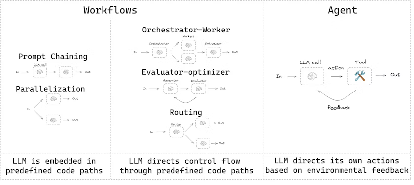

# Part 2: Enhacing Workflows
## Recap

  
  
  ###### To review, this is how a workflow and agent differ from each other in LangGraph.

 

In the previous section, I created a workflow in LangGraph that begins by classifying the user's ticket, retrieving knowledge from the knowledge base, drafting a response, evaluating that response, and revising it if neccessary. 

There were a few issues, however. Notably, the model's final draft was:

> For login issues, tell the user to try resetting their password via the 'Forgot Password' link. The app is known to crash on startup if the user's cache is corrupted. The standard fix is to clear the application cache. Billing inquiries should be escalated to the billing department by creating a ticket in Salesforce.

It basically just regurgitated the information found in the knowledge base. This isn't how an enterprise level LLM should work. The model's response should be tailored to the user's request.

## Introduction
What I did in [Part 1: Workflows](https://github.com/dsuyu1/workflows-and-agents-with-langgraph/tree/4eb2609300a4e35fadb7fbd68ddaf39a92b254dc/Part%201%3A%20Workflows) was an example of **prompt chaining**. According to [the LangChain documentation](https://docs.langchain.com/oss/python/langgraph/workflows-agents):

> Prompt chaining is when each LLM call processes the output of the previous call. It’s often used for performing well-defined tasks that can be broken down into smaller, verifiable steps.

That's what we did with the nodes and edges. We had a series of "well-defined tasks" that chained into each other. There's a whole new world beyond prompt chaining, however. After prompt chaining comes parallelization, routing, orchestration, evaluation, and finally, agents. Part 2: Workflows aims to address these different aspects and discuss the capabilities LangChain and LangGraph give us to extend our workflows and agents, including: 

- Persistence
- Durable execution
- Streaming
- Interrupts
- Time travel
- Memory
- Subgraphs

While Part 1's goal was to be more of a crash course on building something with LangGraph, I hope this section goes into more detail into how to use each component of LangGraph. Now that we have something to build off of, let's get to work! 🧑‍🏭

## Refactoring

