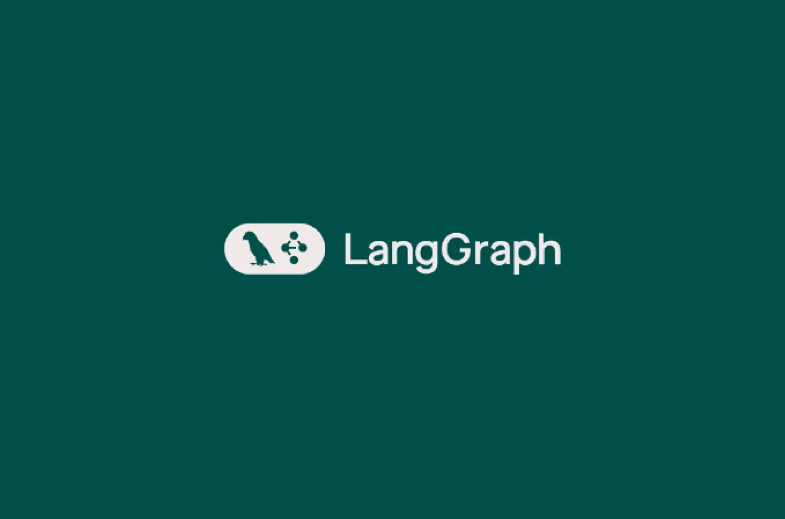
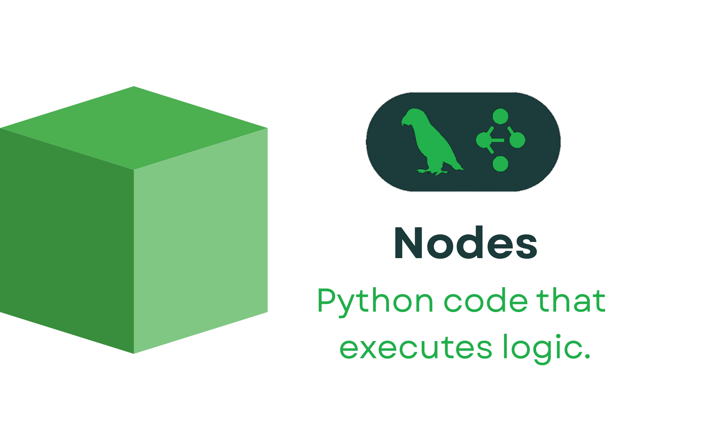

# Workflows and AI Agents with LangGraph
In this project, I build an agentic workflow with Ollama and LangGraph. I will use [this](https://youtu.be/mRx12jkugTE?si=48OSoke3ebptm8gn) tutorial from Venelin Valkov as a guide. However, my implementation is unique and is working as of today's date (11/1/2025).

Feel free to skip forward to the end to see my final product!

## Introduction
I'll build two implementations of the IT support ticket system - one with workflows and the otehr with AI agents to understand the differences and use cases.

The LangGraph library is focused around building workflows and AI agents.

As previously mentioned, our use case is an **intelligent support ticket triage**.

### Problem Statement
Our company is drowning in support tickets. The IT team could use some help! ⚠️

### Proposed Solution
Intelligent ticket processing that:
- Classifies the ticket type (technical, billing, general)
- Retrieves relevant solutions from a knowledge base
- Drafts helpful responses using found information
- Reviews and revises its own work until quality standards are met

The system is rule-based enough to be predictable, complex enough to need orchestration.

### Why don't we just use simple LLM calls?
Simple LLM calls that use if/else statements and loops are fine for systems with 1-2 nodes, but managing and maintaining a complex system with just if/else and loops is too cumbersome. Business logic gets buried, and manual state management is a pain.

LangGraph gives us **three** building blocks to design AI systems like production workflows:
- **State**: This is the system's memory 🧠. The state tracks everything from `ticket_text` to `draft_response`.
- **Nodes**: Nodes are Python functions that do one job well. For example `classify_ticket`, `draft_response`, `evaluate_draft`.
- **Edges**: The paths between the nodes. They are direct connections or conditional logic.

### Workflows vs. Agents: Who's in Control?
| Workflows | Agents |
| --- | --- |
| Developer controls every step | LLM decides the strategy |
| Fixed, predictable path | Dynamic ReAct loop (Reason -> Act -> Observe) |
| Perfect for compliance, data pipelines | Perfect for research, creative problem-solving |
| Rock solid reliability | Adaptive intelligence |

Within a workflow, as a developer, we can control every step of the process. It is easy to debug too!

AI agents are all the rage right now, but even with powerful LLMs, if we have a specific workfllow that needs to be done in a specific order, agents are not able to follow through how we might want them to.

### Human-in-the-Loop: Our Safety Net
Autonomous agents are powerful but can be expensive when they go wrong. We need human oversight, especially in enterprise/production environments. 

We can **add strategic checkpoints:**
- Before **high impact** actions (escalations, billing)
- When AI is **uncertain** (low confidence scores)
- Final quality gate (customer-facing responses)

For example, we can have a function that freezes the graph and waits for human review right before it escalates a ticket. 

Human-in-the-loop takes a cool AI demo app to something you can actually use in production. With humans "in the loop," we can relax knowing that AI won't go crazy. :relieved:

## Part 1: Agentic Workflow
We start by importing everything we need. Most of them come from LangChain. The LangGraph imports will help us build our state graphs.
```python
%pip install -Uqqq pip --progress-bar off
%pip install -Uqqq langchain --progress-bar off
%pip install -Uqqq langchain-openai --progress-bar off
%pip install -Uqqq langchain-google-genai --progress-bar off
%pip install -Uqqq langchain-ollama --progress-bar off
%pip install -Uqqq langchain-community --progress-bar off
%pip install -Uqqq pypdf --progress-bar off
%pip install -Uqqq fastembed --progress-bar off
%pip install -Uqqq langgraph --progress-bar off
%pip install -Uqqq langchain-core --progress-bar offs

# Used to easily create classes for storing data.
from dataclasses import dataclass, field
# Provides type hints for better code readability and maintainability.
from typing import Annotated, List, TypedDict
# Used to display images and other rich output in IPython/Colab.
from IPython.display import Image, display
# Initializes a chat model for language model interactions.
from langchain.chat_models import init_chat_model
# Provides fast and efficient embeddings for text.
from langchain_community.embeddings import HuggingFaceEmbeddings
# Represents a document object, often used in retrieval systems.
from langchain_core.documents import Document
# Represents different types of messages in a conversation.
from langchain_core.messages import AnyMessage, HumanMessage
# Creates templates for generating chat prompts.
from langchain_core.prompts import ChatPromptTemplate
# Decorator to define a function as a tool for language models.
from langchain_core.tools import tool
# An in-memory vector store for storing and searching vector embeddings.
from langchain_core.vectorstores import InMemoryVectorStore
# Components for building state graphs in LangGraph.
from langgraph.graph import END, StateGraph
# Function to add messages to the state in LangGraph.
from langgraph.graph.message import add_messages
```
Initially, I was going to use `gpt-oss`'s latest model provided by Ollama. However, I was having trouble with my API key and whatnot, so I decided to take the easiest route and just have a Hugging Face model saved locally in my Google Colab environment.

```py
from langchain_community.llms import HuggingFacePipeline
from transformers import pipeline

pipe = pipeline("text2text-generation", model="google/flan-t5-large", temperature=0.7, max_length=512)
llm = HuggingFacePipeline(pipeline=pipe)
```

### Adding a dataclass
Our intelligent system workflow starts by defining a **state**. We'll use a `dataclass` to define our state. In LangChain, a `dataclass` is utilized as a method for **defining structure of data**, particularly within the context of managing state in LangGraph. 

```python
@dataclass # defines structure of a our LangChain states
class TicketTriageState:
  ticket_text: str
  classification: str= "" #
  retrieved_docs: List[Document] = field(default_factory=lambda: []) # subject to change
  draft_response: str = ""
  evaluation_feedback: str = ""
  revision_count: int = 0 # sets revision_count to 0 to start
```

### A quick explanation of nodes in LangGraph


In LangGraph, a **node** is a _function_ that represents a single unit of computation or a specific step in a workflow.

### Classification of the prompt
```python
CLASSIFY_PROMPT = """
Classify this support ticket into one of the following categories:
'Technical Issue', 'Billing Inquiry', 'General Question'.

<ticket>
{ticket_text}
</ticket>
""".strip()

def classify_ticket(state: TicketTriageState) -> dict:
  classification = llm.invoke(CLASSIFY_PROMPT.format(ticket_text=state.ticket_text))
  # returns a dictionary, where "classification" is the key, and the value is what the LLM
  # generated from the line above. It took the ticket_text from the dataclass we defined earlier,
  # and used the state's ticket_text to give the ticket a classification
  return {"classification": classification}
```
In summary, the LLM takes the text from the ticket and determines a classification for the ticket. True to the nature of nodes, that is all this first function does.

### Contacting the knowledge base
Next we'll simulate a knowledge base for the LLM to pull information from.

```python
from langchain_community.embeddings import FastEmbedEmbeddings

knowledge_base = [
    "For login issues, tell the user to try resetting their password via the 'Forgot Password' link.",
    "Billing inquiries should be escalated to the billing department by creating a ticket in Salesforce.",
    "The app is known to crash on startup if the user's cache is corrupted. The standard fix is to clear the application cache.",
]
embeddings = HuggingFaceEmbeddings(model_name="sentence-transformers/all-MiniLM-L6-v2")

vector_store = InMemoryVectorStore.from_texts(knowledge_base, embeddings)
retriever = vector_store.as_retriever()


def retrieve_knowledge(state: TicketTriageState) -> dict:
    retrieved_docs = retriever.invoke(state.ticket_text)
    return {"retrieved_docs": retrieved_docs}
```
This is just a sample knowledge base for now. Afterwards, I plan on making this an actual database. For now, let's just define all the functions and make updates later.

### Drafting the response
Next, we'll draft the model's response.

```python
DRAFT_PROMPT = """
Based on this context:
<context>
{context}
</context>

Draft a response for this ticket:
<ticket>
{ticket}
</ticket>
""".strip()

def draft_response(state: TicketTriageState) -> dict:
  context = "\n".join([doc.page_content for doc in state.retrieved_docs])
  prompt = DRAFT_PROMPT.format(context=context, ticket=state.ticket_text)
  draft = llm.invoke(prompt)
  return {"draft_response": draft}
```

### Response evaluation
Based on the context the model generated, it will draft its first response to the prompt. Next, let's create the evaluation node.

```python
EVALUATE_PROMPT = """
Does this draft
<draft>
{draft_response}
</draft>

fully address the ticket

<ticket>
{ticket_text}
</ticket>

If not, provide feedback.
Respond with 'PASS' or 'FAIL: [feedback]'."
""".strip()

def evaluate_draft(state: TicketTriageState) -> dict:
  evaluation_prompt = EVALUATE_PROMPT.format(
    draft_response=state.draft_response,
    ticket_text=state.ticket_text,
  )
  evaluation_result = llm.invoke(evaluation_prompt)
  revision_count = state.revision_count + 1
  return {"evaluation_feedback": evaluation_result, "revision_count": revision_count}
```
This node sets up the mechanism for the language model to review the drafted response and determine if it's sufficient, providing feedback if necessary, and tracking the number of evaluations.

### Revising the response draft
```python
REVISE_PROMPT = """
Revise this draft:
<draft>
{draft_response}
</draft>

based on the following feedback:

<feedback>
{evaluation_feedback}
</feedback>
""".strip()

def revise_response(state: TicketTriageState) -> dict:
  revise_prompt = REVISE_PROMPT.format(
    draft_response=state.draft_response,
    evaluation_feedback=state.evaluation_feedback,
  )
  return {"draft_response": llm.invoke(revise_prompt)}
```
`REVISE_PROMPT` is a string that provides instructions to the language model on how to revise the draft. It includes the existing draft ({`draft_response`}) and the feedback received from the evaluation step ({evaluation_feedback}). 

`revise_prompt` is sent to the model, and the model will use the draft and feedback to generate a revised version of the response. Basically, this node enables the language model to take the feedback from the evaluation step and use it to improve the initial draft of the response.

### If "FAIL," revise
```python
def should_revise(state: TicketTriageState) -> str:
    feedback = state.evaluation_feedback
    revision_count = state.revision_count

    if "FAIL" in feedback and revision_count < 3:
        return "revise"
    else:
        return "end"
```
Here is where we implement the logic we defined previously. 

- If the `evaluation_feedback` contains the word "FAIL" AND the `revision_count` is less than 3, the function returns the string `"revise"`. This signals to the LangGraph that the workflow should go to the "revise" node to attempt to improve the draft.
- If the `evaluation_feedback` does not contain "FAIL" OR the `revision_count` is 3 or more, the function returns the string `"end"`. This signals to the LangGraph that the workflow should stop at this point, either because the draft passed the evaluation or because it has been revised too many times.

### Generating our graph
```python
graph = StateGraph(TicketTriageState)

# all of the nodes we just defined
graph.add_node("classify", classify_ticket)
graph.add_node("retrieve", retrieve_knowledge)
graph.add_node("draft", draft_response)
graph.add_node("evaluate", evaluate_draft)
graph.add_node("revise", revise_response)


# we connect all the nodes with edges
graph.add_edge("classify", "retrieve")
graph.add_edge("retrieve", "draft")
graph.add_edge("draft", "evaluate")

graph.add_edge("revise", "evaluate")

graph.add_conditional_edges( # if we need to revise the draft, we will go back to revise node
                            # otherwise, we end execution
    "evaluate",
    should_revise,
    {
        "revise": "revise",
        "end": END,
    },
)

graph.set_entry_point("classify") # all support tickets start with classify node
app = graph.compile() # puts our graph together
```

### Displaying the graph
```python
display(Image(app.get_graph().draw_mermaid_png())) # our compiled graph
```


### Running the workflow
```py
# Test the system
initial_state = { 
    "ticket_text": "My login is broken, please help!",
    "retrieved_docs": [],
    "classification": "", # Changed from category to classification
    "draft_response": "" # Changed from response to draft_response
}

final_state = app.invoke(initial_state) 

# prints our final state stuff
print("=== TICKET TRIAGE RESULTS ===")
print(f"Original Ticket: {final_state['ticket_text']}")
print(f"Classification: {final_state['classification']}") 
# print(f"Priority: {final_state['priority']}") # maybe add Priority later
print(f"\nResponse:\n{final_state['draft_response']}")
```
### Printing the final classification
```py
print(final_state["classification"])
```
The model successfully identifies the issue as a `Technical Issue`.

### Printing the revision count
```py
print(final_state["revision_count"])
```
Only one revision was applied to the initial draft. (`revision_count` == 1).

### Print the draft of the response
It's the moment of truth!~ 🚀 Let's see what our model came up with.

```py
print(final_state["draft_response"])
```
The response from the model was:

> For login issues, tell the user to try resetting their password via the 'Forgot Password' link. The app is known to crash on startup if the user's cache is corrupted. The standard fix is to clear the application cache. Billing inquiries should be escalated to the billing department by creating a ticket in Salesforce.

And with that, we've successfully created an agentic workflow with LangGraph! ☄️

## Part 2: AI Agents


